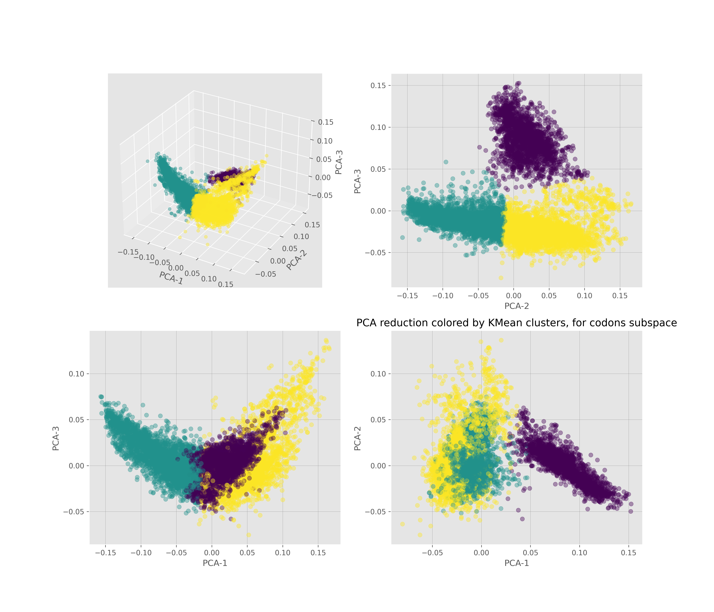

# DNA codons data analysis

[codons open dataset from kaggle](https://www.kaggle.com/datasets/salikhussaini49/codon-usage)

this was the final project of a discipline class in introduction to computer science.

in this plot we can see how the codons cluster over a reduced dimensionality space. Noticed the purple cluster, they are specially distinct from the rest.

in this plot we can see the kingdom source of each cluster. notice that the kingdoms of rodent, mammal, primate and vertebate constitute most of the purple category.

such results show interesting similarity of the codons composition between those kingdoms.
